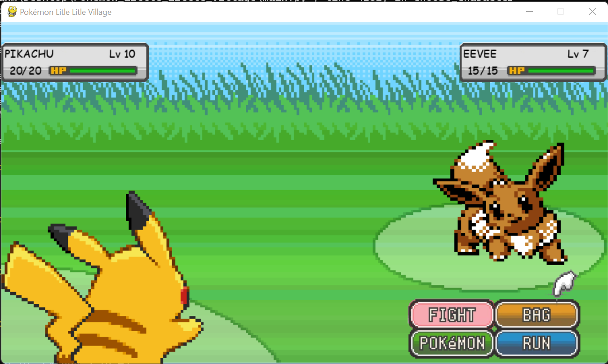

  <br/>
Pocket Monster Game Based on Python

 
<br/>

# Screenshots



<br/>

# System Requirements
• <a href="https://www.python.org/downloads/">Python 3.10 version or newer</a><br/>
<br/>

# Status

- [x] Draw Map
- [x] Define map obstacles & limits
- [x] Define player basic moves
- [x] Define player bicicle moves
- [x] Basic Pokémon wild encounter
- [ ] Fully working wild encounter
- [ ] Pokemon Inventory
- [ ] Pokemon following the trainer
- [ ] Create more Pokémon

# Installation

```GNU/Linux ```
```
git clone https://github.com/daviiid99/Pokemon-Little_Little_Town.git Pokemon-Little_Little_Town
cd Pokemon-Little_Little_Town
python3 main.py
```
<br/>

``` Microsoft Windows```
```
git clone https://github.com/daviiid99/Pokemon-Little_Little_Town.git Pokemon-Little_Little_Town
cd Pokemon-Little_Little_Town
python main.py
```
