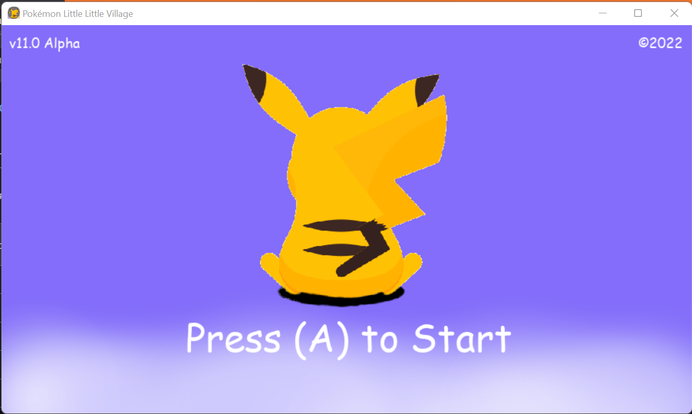

  <br/>

Pokémon Little Little Village is an open-source and Pocket Monster based game powered by the Python Programming Language and the Pygame framework which provides of beautiful UI

This project use other open-source libs like Mixer which provides ambient sounds inside the game.

<br/>

This game is time based, all the events inside the game change every hour, that's possible thanks to an internal clock!.

If you play at evening, the background will get dark and blue and the wild encounter background will change too. Also the Pokemon will be different


 
<br/>

# Video Preview

<a href="https://youtu.be/nNwWvz-fez8"></a>


<br/>

# System Requirements
• <a href="https://www.python.org/downloads/">Python 3.10 version or newer</a><br/>
<br/>

# Status

- [x] Draw Map
- [x] Define map obstacles & limits
- [x] Define player basic moves
- [x] Define player bicicle moves
- [x] Basic Pokémon wild encounter
- [x] Create time based background
- [x] Create time based Pokémon events
- [x] Pokémon Inventory
- [x] Pokémon following the trainer
- [x] Create new buildings
- [x] Create choose Starter event
- [x] Defined Oak and Trainer house
- [x] Working save game slot
- [x] Trainer bag
- [x] Create more Pokémon
- [x] New Map area with shop and Pokemon Center
- [x] Fully working Pokemon Center and shop
- [ ] Fully working wild encounter
- [ ] Fully working Pokemon bag
- [ ] New Safari Zone
- [ ] Pokemon Bank
# Installation

```GNU/Linux ```
```
git clone https://github.com/daviiid99/Pokemon_Little_Little_Village.git Pokemon_Little_Little_Village
cd Pokemon_Little_Little_Village
python3 main.py
```
<br/>

``` Microsoft Windows```
```
git clone https://github.com/daviiid99/Pokemon_Little_Little_Village.git Pokemon_Little_Little_Village
cd Pokemon_Little_Little_Village
python main.py
```
