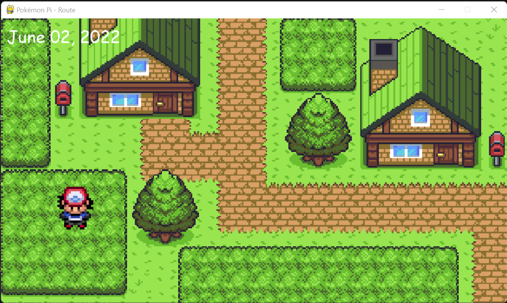

  <br/>
Pocket Monster Game Based on Python

 
<br/>

# Screenshots


<br/>

# System Requirements
• <a href="https://www.python.org/downloads/">Python 3.10 version or newer</a><br/>
<br/>

# Status
W.I.P
<br/>

# Installation

```GNU/Linux ```
```
git clone https://github.com/daviiid99/Pokemon-Pi.git Pokemon-Pi
cd Pokemon-Pi
python3 main.py
```
<br/>

``` Microsoft Windows```
```
git clone https://github.com/daviiid99/Pokemon-Pi.git Pokemon-Pi
cd Pokemon-Pi
python main.py
```
